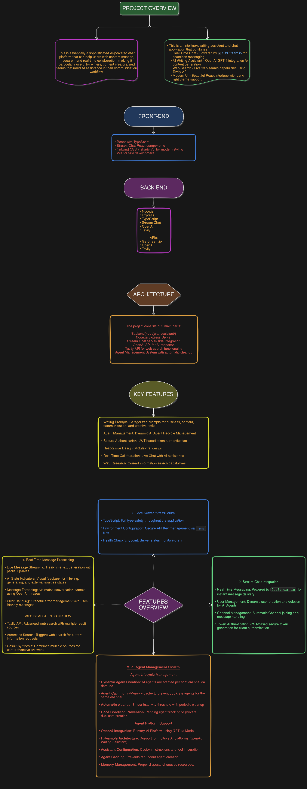

# CharchaAI

AI Writing Assistant with real-time chat, streaming responses, and per-channel AI agents powered by OpenAI Assistants and Stream Chat.

## Overview

CharchaAI is a full‑stack TypeScript application that turns any chat channel into a collaborative AI writing partner. It combines a modern React UI with a Node.js/Express backend, integrates OpenAI’s GPT‑4 family via the Assistants API (with tool/function calling), and uses Stream Chat for real‑time messaging, presence, and message persistence.

Core capabilities:

- Streaming AI replies for a fast, natural chat experience
- Ready‑to‑use writing prompts (business, content, communication, creative)
- Per‑channel AI agent lifecycle (start/stop/status) with auto‑cleanup
- “AI thinking” indicators and progressive response updates

## Tech stack

- Frontend: React 18, TypeScript, Vite, Tailwind CSS, Radix UI, shadcn/ui, Framer Motion
- Backend: Node.js (>=20), Express, TypeScript, OpenAI SDK, Stream Chat Server SDK
- Realtime & Auth: Stream Chat (token provider, WebSocket messaging)

## Project structure

```
.
├─ backend/
│  ├─ package.json
│  ├─ tsconfig.json
│  └─ src/
│     ├─ index.ts                 # Express server & API endpoints
│     ├─ serverClient.ts          # Stream Chat server client
│     └─ agents/
│        ├─ types.ts              # Agent interface & enums
│        └─ openai/
│           ├─ OpenAIAgent.ts     # OpenAI agent (Assistants API + streaming)
│           └─ OpneAIResponseHandler.ts # Stream handler, tool calls (web_search)
└─ frontend/
	 ├─ package.json
	 ├─ src/
	 │  ├─ App.tsx                  # App shell: login/authenticated app
	 │  ├─ components/              # Chat UI (input, message, sidebar, prompts)
	 │  ├─ providers/chat-provider.tsx # Stream Chat client + token provider
	 │  └─ hooks/                   # use-ai-agent-status, theme, etc.
	 └─ vite.config.ts
```

## How it works

High‑level flow:

1. Frontend requests a Stream Chat auth token from the backend (`POST /token`) and connects to Stream.
2. User joins or opens a channel; the UI can start the AI agent for that channel (`POST /start-ai-agent`).
3. Backend creates a dedicated AI user (e.g., `ai-bot-<channel_id>`), joins it to the channel, and spins up an OpenAI Assistant thread.
4. When a new human message arrives in the channel, the backend forwards it to the Assistant and streams the response back, updating the message in real time and emitting “thinking” indicators.
5. Agents are cached per channel and auto‑disposed after inactivity to save cost and memory.

Simple message flow diagram:

```
Human → Stream Channel → Backend (message.new) → OpenAI Assistant (thread/run)
	 ↘────────── stream updates / indicators ──────────↙
								Stream Channel ← Backend (AI response)
```

## Features

- Real‑time chat with streaming AI responses
- Web‑search tool call via OpenAI Assistants to fetch current info
- Prompt catalog by category (business, content, communication, creative)
- Per‑channel AI agent orchestration: start, stop, get status
- Auto cleanup of inactive agents (8‑hour threshold by default)
- “AI thinking” and “using external sources” indicators

## API (backend)

Base URL (local): `http://localhost:3000`

1. `POST /token`

- Request body: `{ "userId": string }`
- Response: `{ "token": string }`
- Purpose: Issues short‑lived Stream Chat tokens for frontend clients.

2. `POST /start-ai-agent`

- Request body: `{ "channel_id": string, "channel_type"?: "messaging" | string }`
- Response: `{ message: "AI Agent Started", data: [] }`
- Side effects: Creates/joins `ai-bot-<channel_id>`, initializes OpenAI Assistant & thread, subscribes to new messages.

3. `POST /stop-ai-agent`

- Request body: `{ "channel_id": string }`
- Response: `{ message: "AI Agent Stopped", data: [] }`
- Side effects: Disposes the agent, disconnects the AI user, hard‑deletes it from Stream.

4. `GET /agent-status?channel_id=<id>`

- Response: `{ status: "connected" | "connecting" | "disconnected" }`
- Purpose: Shows if the per‑channel agent is up, spinning up, or stopped.

Notes:

- Agents are keyed by `ai-bot-<channel_id>` and cached in memory.
- Inactivity threshold is `480 * 60 * 1000` ms (8 hours) with a periodic sweep.

## Environment variables

Create the following `.env` files before running locally.

Backend (`backend/.env`):

```
STREAM_API_KEY=<your_stream_api_key>
STREAM_API_SECRET=<your_stream_api_secret>
OPENAI_API_KEY=<your_openai_api_key>
PORT=3000
```

Frontend (`frontend/.env`):

```
VITE_STREAM_API_KEY=<your_stream_api_key>
VITE_BACKEND_URL=http://localhost:3000
```

## Running locally (Windows PowerShell)

Prerequisites:

- Node.js 20+
- Stream Chat account (API key/secret)
- OpenAI API key

Install & run backend:

```powershell
cd backend
npm install
npm run dev
```

Install & run frontend:

```powershell
cd frontend
npm install
npm run dev
```

## Configuration notes

- CORS is set to `*` in development. For production, set a specific origin.
- Backend enforces Node `>=20` via `engines` and uses TypeScript build (`tsc`).
- OpenAI model: configured in `OpenAIAgent.ts` (e.g., `gpt-4o`) with Assistants + `web_search` function.


